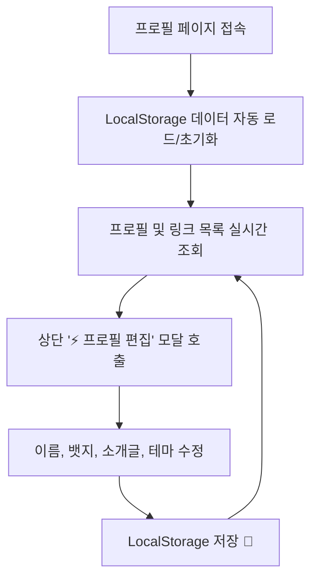
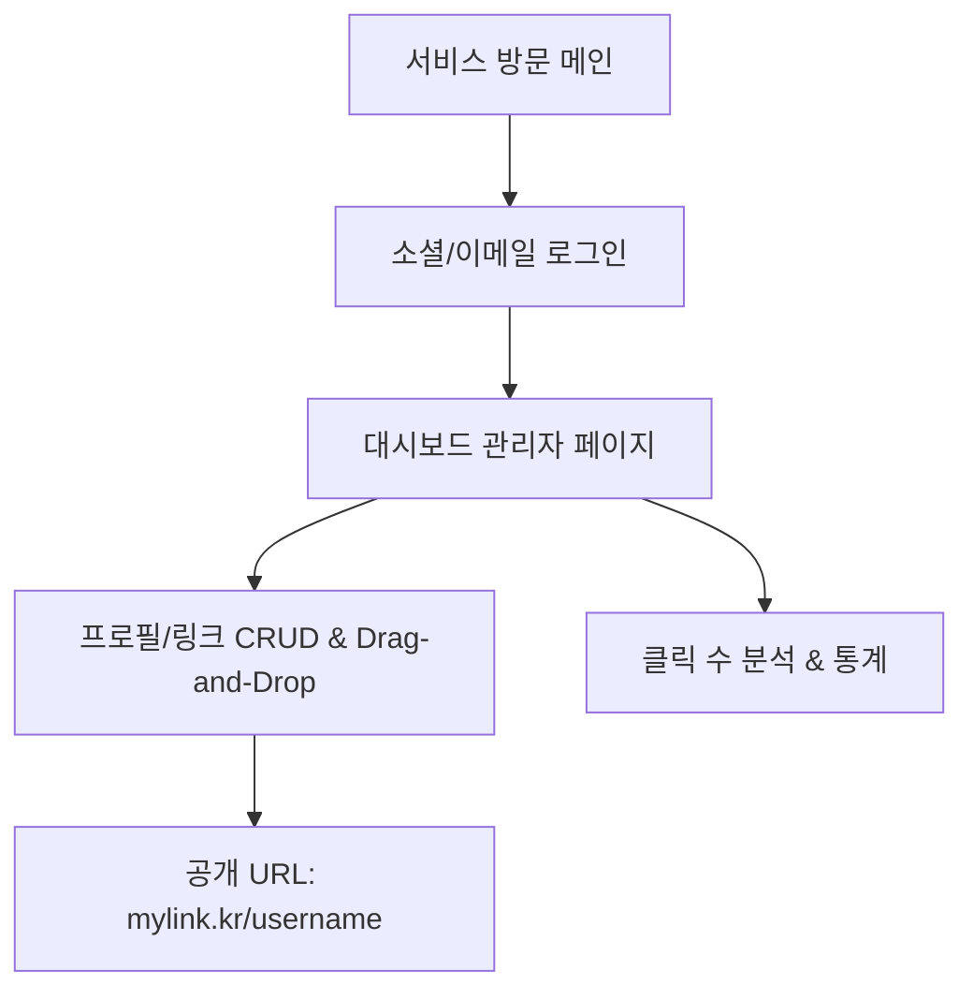

# 📄 마이링크 (MyLink) 서비스 PRD (제품 기능 명세서)

> **프로젝트 명**: 마이링크 (MyLink)  
> **버전**: v1.1.0 (시연용 LocalStorage 단계 반영)  
> **작성일**: 2026-09-30  
> **문서 상태**: Approved (시연 단계 반영)

---

## 1. 제품 개요 (Product Overview)

### 1.1 배경 및 목적
* **개요**: 누구나 자신만의 프로필과 주요 링크(소셜 미디어, 블로그, 포트폴리오, 연락처 등)를 하나의 가볍고 스타일리시한 웹 페이지로 묶어 공유할 수 있는 **링크트리 클론 서비스**입니다.
* **시연(Demo) 단계 전략**:
  - 현재 시연 단계에서는 백엔드/대시보드 구축 전 **`LocalStorage` 기반의 인라인 프로필 편집 및 동적 테마 전환**을 통해 핵심 사용자 경험(UX)을 단계별로 시연합니다.

---

## 2. 사용자 여정 (User Flow & Journey)

### 2.1 시연 단계 (Phase 1 - Current Demo)

### 2.2 풀스택 확장 단계 (Phase 2 & 3 - Future Roadmap)

---

## 3. 상세 기능 명세 (Detailed Specifications)

### F-1. 시연용 로컬 데이터 관리 (LocalStorage Demo - Phase 1)
| 기능 ID | 기능 명 | 상세 설명 | 구현 상태 |
| :--- | :--- | :--- | :--- |
| **DEMO-01** | LocalStorage 연동 | `mylink_demo_profile_v1` 키를 사용해 프로필 정보(이름, 소개글, 뱃지, 테마, 링크) 저장 및 자동 로드 | ✅ 완료 |
| **DEMO-02** | 인라인 프로필 편집 | 대시보드 없이 팝업 모달에서 프로필 실시간 수정 및 LocalStorage 반영 | ✅ 완료 |
| **DEMO-03** | 테마 스위처 | 🎮 `닌텐도 레트로 메탈` / 🌊 `오션 블루 글라스` / ⚡ `네오브루탈리즘 팝` 테마 실시간 전환 | ✅ 완료 |
| **DEMO-04** | 데이터 초기화 | 시연 복구를 위해 로컬 데이터를 기본 프로필(노기훈, 정부 항해사)로 리셋하는 기능 | ✅ 완료 |

### F-2. 풀스택 확장 기능 (Phase 2 & 3 - Future)
| 기능 ID | 기능 명 | 상세 설명 | 계획 단계 |
| :--- | :--- | :--- | :--- |
| **AUTH-01** | 사용자 인증 | Google, GitHub 소셜 로그인 및 이메일 가입 (Firebase/Supabase) | Phase 2 |
| **DASH-01** | 관리자 대시보드 | 로그인한 유저 전용 링크/프로필 편집 대시보드 | Phase 2 |
| **LINK-02** | Drag & Drop 순서 변경 | 마우스 드래그 기반 링크 카드 순서 재배치 | Phase 3 |
| **STAT-01** | 클릭 수 & 통계 | 공개 링크별 실시간 클릭 트래킹(Click Count) 및 방문자 수 | Phase 3 |

---

## 4. 기술 아키텍처 (Technical Architecture)

### 4.1 프론트엔드 (Frontend)
* **Framework**: Next.js 16 (App Router)
* **Language**: TypeScript 5
* **Styling**: Tailwind CSS v4 + Custom Bevel / Glass / Neobrutalism CSS
* **Storage**: Browser `localStorage` (Phase 1) ➔ Firebase Firestore / Supabase PostgreSQL (Phase 2)

---

## 5. 단계별 구현 로드맵 (Milestones)

| 단계 | 주요 작업 내용 | 상태 |
| :--- | :--- | :--- |
| **Phase 1 (Current Demo)** | • LocalStorage 기반 시연용 프로필 페이지 • 실시간 데이터/테마 편집 모달 • 닌텐도/오션/네오브루탈 디자인 지원 | **✅ 완료 (시연 중)** |
| **Phase 2 (Full-stack MVP)** | • Firebase/Supabase Auth & Firestore 연동 • `/[username]` 동적 라우팅 및 대시보드 | 대기 |
| **Phase 3 (Production)** | • Drag & Drop, 클릭 통계 분석, 커스텀 도메인 배포 | 대기 |

---

> **비고**: 본 PRD 문서는 시연 단계(Phase 1 - LocalStorage 연동) 요구사항을 반영하여 업데이트되었습니다.
