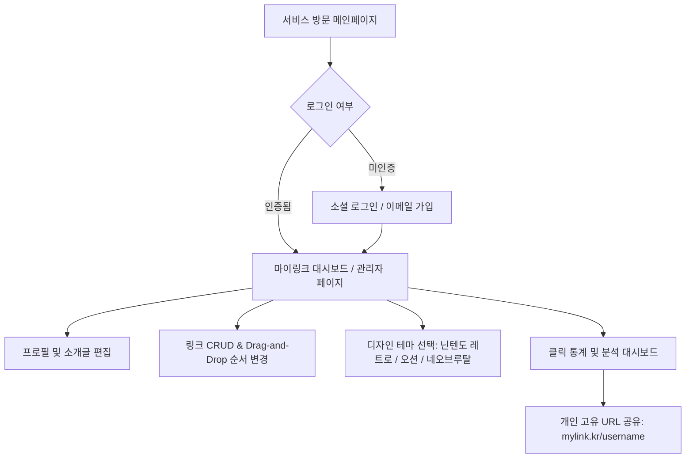

# 📄 마이링크 (MyLink) 서비스 PRD (제품 기능 명세서)

> **프로젝트 명**: 마이링크 (MyLink)  
> **버전**: v1.0.0  
> **작성일**: 2026-09-30  
> **문서 상태**: Approved (요구사항 확정)

---

## 1. 제품 개요 (Product Overview)

### 1.1 배경 및 목적
* **개요**: 누구나 자신만의 프로필과 주요 링크(소셜 미디어, 블로그, 포트폴리오, 연락처 등)를 하나의 가볍고 스타일리시한 웹 페이지로 묶어 공유할 수 있는 **동적 풀스택 링크트리 클론 서비스**입니다.
* **핵심 목표**:
  1. 간편한 회원가입 후 1분 만에 자신만의 개인화 고유 URL(`/[username]`) 생성.
  2. 직관적인 대시보드를 통해 링크 추가·수정·삭제 및 순서 변경(Drag & Drop) 지원.
  3. 닌텐도 레트로 콘솔 테마, 오션 블루 테마 등 다양한 디자인 테마 선택 기능 제공.
  4. 링크별 실시간 클릭 수 통계 및 분석 기능 제공.

### 1.2 타겟 사용자 (Target Audience)
* **크리에이터 & 개발자**: 소스 코드(GitHub), 블로그, SNS를 한곳에 묶어 전달하고 싶은 개발자/항해사 등.
* **퍼스널 브랜딩 사용자**: 인스타그램, 유튜브, 이메일 등의 접점을 간편하게 공유하고 싶은 개인 및 대학생.

---

## 2. 사용자 여정 (User Flow & Journey)

---

## 3. 상세 기능 명세 (Detailed Specifications)

### F-1. 회원가입 및 사용자 인증 (Authentication & User Management)
| 기능 ID | 기능 명 | 상세 설명 | 우선순위 |
| :--- | :--- | :--- | :--- |
| **AUTH-01** | 소셜 로그인 | Google, GitHub 간편 로그인 지원 (Firebase Auth / Supabase Auth) | P0 (Must Have) |
| **AUTH-02** | 이메일/비밀번호 가입 | 이메일 기반 회원가입 및 로그인 | P0 (Must Have) |
| **AUTH-03** | 고유 핸들(ID) 설정 | 회원가입 시 중복되지 않는 고유 사용자 ID(`username`) 검증 및 등록 | P0 (Must Have) |

### F-2. 개인 프로필 및 링크 대시보드 (Admin Dashboard & CRUD)
| 기능 ID | 기능 명 | 상세 설명 | 우선순위 |
| :--- | :--- | :--- | :--- |
| **LINK-01** | 링크 추가/수정/삭제 | 제목, URL, 이모지/아이콘, 설명, 활성화 여부(ON/OFF) 관리 | P0 (Must Have) |
| **LINK-02** | Drag & Drop 순서 재배치 | 마우스/터치 드래그로 링크 카드의 노출 순서를 손쉽게 변경 | P1 (Should Have) |
| **PROF-01** | 프로필 정보 수정 | 프로필 이미지, 실명/닉네임, 뱃지(예: ⚓ 정부 항해사), 소개글 편집 | P0 (Must Have) |

### F-3. 공개 프로필 페이지 및 테마 엔진 (Public Page & Theme Engine)
| 기능 ID | 기능 명 | 상세 설명 | 우선순위 |
| :--- | :--- | :--- | :--- |
| **PAGE-01** | 동적 라우팅 페이지 | `/[username]` 경로 접속 시 해당 사용자의 프로필 및 활성화된 링크 노출 | P0 (Must Have) |
| **THEME-01** | 닌텐도 레트로 메탈 테마 | 페리윙클 섀시 + 입체 3D 베벨 메탈 카드 + 카본 패널 디자인 | P0 (Must Have) |
| **THEME-02** | 오션 블루 테마 | 깊은 바다 그라데이션 + 글라스모피즘 반투명 카드 테마 | P1 (Should Have) |
| **THEME-03** | 네오브루탈리즘 테마 | 두꺼운 4px 검은 테두리 + 하드 오프셋 그림자 + 팝 컬러 테마 | P1 (Should Have) |

### F-4. 클릭 통계 및 실시간 분석 (Analytics)
| 기능 ID | 기능 명 | 상세 설명 | 우선순위 |
| :--- | :--- | :--- | :--- |
| **STAT-01** | 전체 방문자 수 카운팅 | 공개 프로필 페이지의 누적 조회수(View Count) 트래킹 | P1 (Should Have) |
| **STAT-02** | 링크별 클릭 수 추적 | 사용자가 각 링크를 클릭할 때마다 클릭 수(Click Count) +1 증가 및 기록 | P1 (Should Have) |

---

## 4. 기술 아키텍처 및 시스템 구조 (Technical Architecture)

### 4.1 프론트엔드 (Frontend)
* **Framework**: Next.js 16 (App Router)
* **Language**: TypeScript 5
* **Styling**: Tailwind CSS v4 + Custom Bevel / Glass / Neobrutalism CSS
* **State Management**: React Context / Zustand
* **Drag & Drop**: `@dnd-kit/core` 또는 `@hello-pangea/dnd`

### 4.2 백엔드 & 데이터베이스 (Backend & Database)
* **BaaS Provider**: Firebase (Firebase Auth + Cloud Firestore) 또는 Supabase (PostgreSQL)
* **Database Schema (Cloud Firestore 예시)**:
  - `users/{userId}`: `{ uid, username, displayName, bio, badges, theme, createdAt }`
  - `users/{userId}/links/{linkId}`: `{ title, url, emoji, category, isEnabled, order, clickCount, createdAt }`
  - `analytics/{username}`: `{ totalViews, totalClicks }`

---

## 5. 개발 로드맵 (Development Roadmap)

| 단계 | 주요 작업 내용 | 예상 결과물 |
| :--- | :--- | :--- |
| **Phase 1 (MVP)** | • Next.js 라우터 구조 및 Firebase Auth / Firestore 연동 • 기본 프로필/링크 CRUD 관리자 페이지 및 공개 `/[username]` 페이지 | 회원가입 및 기본 링크 생성 동작 |
| **Phase 2 (Enhancement)** | • Drag & Drop 링크 순서 변경 기능 • 링크 클릭 수 및 방문자 수 실시간 트래킹 카운터 연동 | 순서 변경 & 통계 기능 완성 |
| **Phase 3 (Polishing)** | • 테마 스위처 (닌텐도 레트로 / 오션 / 네오브루탈리즘 선택) • Vercel 프로덕션 배포 및 SEO 최적화 | 완제품 서비스 릴리즈 |

---

> **비고**: 본 PRD 문서는 사용자 요구사항 인터뷰를 기반으로 작성되었으며, `docs/PRD.md`에 보관됩니다.
